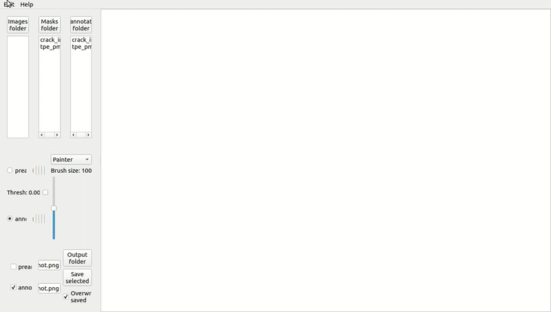
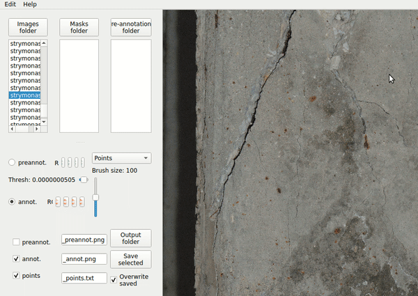

[](https://badge.fury.io/py/secv-guis) [](https://travis-ci.org/andres-fr/secv-guis) [](https://secv-guis.readthedocs.io/en/latest/?badge=latest)

# SECV GUIs

Repository hosting diverse Python3 Qt GUIs made at the Systems Engineering and Computer Vision Department @ Goethe University Frankfurt.

## DEMOS:

### Bimask App:

This application allows the user to load, edit and save different annotations and pre-annotations for high-resolution images. Note that the GUI does **not** integrate the pre-annotation vision modules, it simply loads their results from the filesystem. For more details see the [instructions](secv_guis/bimask_app/instructions.txt)





## Install and run:

The recommended way is to install from PyPI via command line interface. Using a fresh environment, it would look like this:

```
cd /tmp
virtualenv -p python3 venv
source venv/bin/activate
pip install secv-guis
python -m secv_guis
```

You can also clone this package from GitHub, or pull the latest release: https://github.com/andres-fr/secv-guis/releases
The badges above link to the documentation and PyPI webpages. Please let me know if you encounter any issue!


## Developers:

The project is split in 2 main parts: the modules at the top level contain reusable parts (library-space). Each directory contains then an application (app-space).
To create a new app, make a new folder with your desired app-specific contents, and include it into `__main__`. If you develop reusable contents, consider adding them to the top-level modules to be used in further apps. Conversely, avoid API-breaking changes into the reusable components, unless you make sure that all the apps are conveniently updated.

The ``.travis.yml`` file contains examples on how to run code style check, unit tests with coverage, build and autodoc. You can see more detailed information here: https://github.com/andres-fr/python3-template/blob/master/README.md

Also, the documentation for this own repository should help extending the software: https://secv-guis.readthedocs.io/en/latest/?badge=latest

## Rationale:

The necessity of the bi-mask annotation GUI was concluded after conversations with the Civil Engineers, and driven by our struggling attempts to annotate cracks with pixel-precision consistently from different setups. When looking for existing tools, we needed a python-based extendable tool that would allow for "free painting"  as well as combining preannotations with annotations. It should be reasonably responsive when working with high-resolution images.

The following is the result of an exhaustive search of available OSS labeling tools whose functionality would intersect with our requirements. No existing tool matched them close enough, most of them lacking pixel-precise segmentation, a.k. "free painting", or integration of preannotated masks. A list can be found [here](https://github.com/heartexlabs/awesome-data-labeling):

* [labelImg](https://github.com/tzutalin/labelImg) - LabelImg is a graphical image annotation tool and label object bounding boxes in images
* [CVAT](https://github.com/opencv/cvat) - Powerful and efficient Computer Vision Annotion Tool
* [labelme](https://github.com/wkentaro/labelme) - Image Polygonal Annotation with Python
* [VoTT](https://github.com/microsoft/VoTT) - An open source annotation and labeling tool for image and video assets
* [imglab](https://github.com/NaturalIntelligence/imglab) - A web based tool to label images for objects that can be used to train dlib or other object detectors
* [Yolo_mark](https://github.com/AlexeyAB/Yolo_mark) - GUI for marking bounded boxes of objects in images for training neural network Yolo v3 and v2
* [PixelAnnotationTool](https://github.com/abreheret/PixelAnnotationTool) - Software that allows you to manually and quickly annotate images in directories
* [OpenLabeling](https://github.com/Cartucho/OpenLabeling) - Label images and video for Computer Vision applications
* [imagetagger](https://github.com/bit-bots/imagetagger) - An open source online platform for collaborative image labeling
* [Alturos.ImageAnnotation](https://github.com/AlturosDestinations/Alturos.ImageAnnotation) - A collaborative tool for labeling image data
* [deeplabel](https://github.com/jveitchmichaelis/deeplabel) - A cross-platform image annotation tool for machine learning
* [MedTagger](https://github.com/medtagger/MedTagger) - A collaborative framework for annotating medical datasets using crowdsourcing.
* [Labelbox](https://github.com/Labelbox/Labelbox) - Labelbox is the fastest way to annotate data to build and ship computer vision applications
* [turktool](https://github.com/jaxony/turktool) - A modern React app for scalable bounding box annotation of images
* [Pixie](https://github.com/buni-rock/Pixie) - Pixie is a GUI annotation tool which provides the bounding box, polygon, free drawing and semantic segmentation object labelling
* [OpenLabeler](https://github.com/kinhong/OpenLabeler) - OpenLabeler is an open source desktop application for annotating objects for AI appplications
* [Anno-Mage](https://github.com/virajmavani/semi-auto-image-annotation-tool) - A Semi Automatic Image Annotation Tool which helps you in annotating images by suggesting you annotations for 80 object classes using a pre-trained model
* [CATMAID](https://github.com/catmaid/CATMAID) - Collaborative Annotation Toolkit for Massive Amounts of Image Data
* [make-sense](https://github.com/SkalskiP/make-sense) - makesense.ai is a free to use online tool for labelling photos
* [LOST](https://github.com/l3p-cv/lost) - Design your own smart Image Annotation process in a web-based environment
